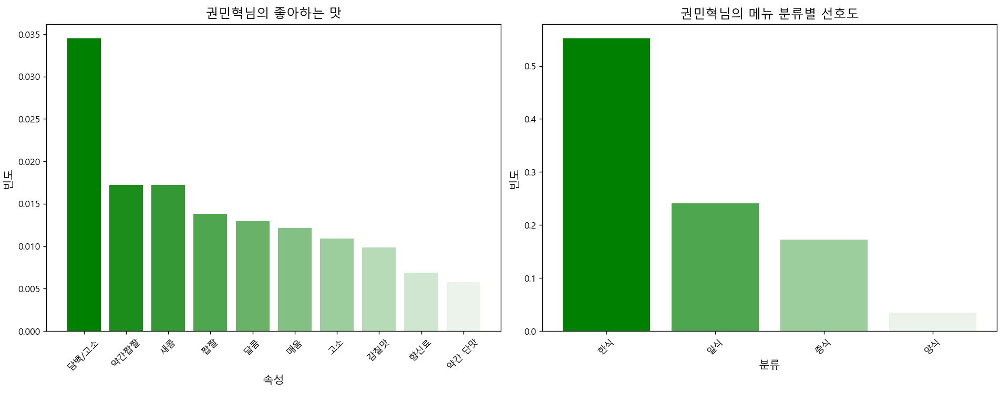
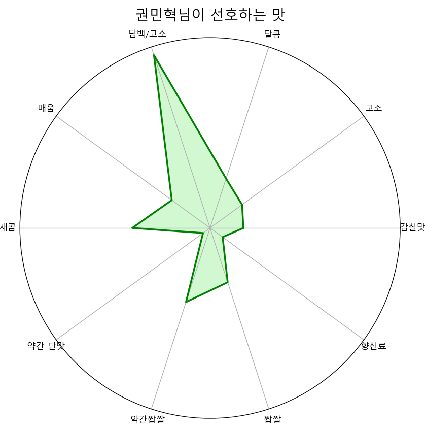
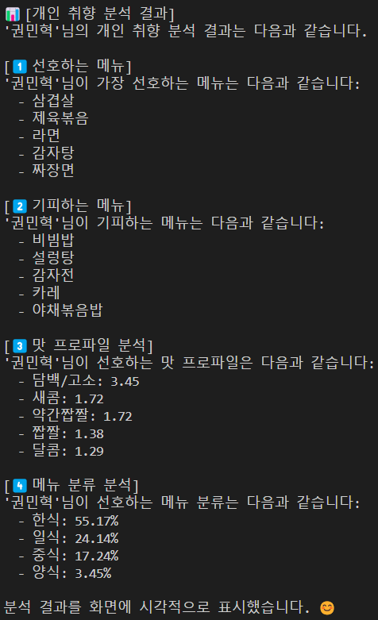
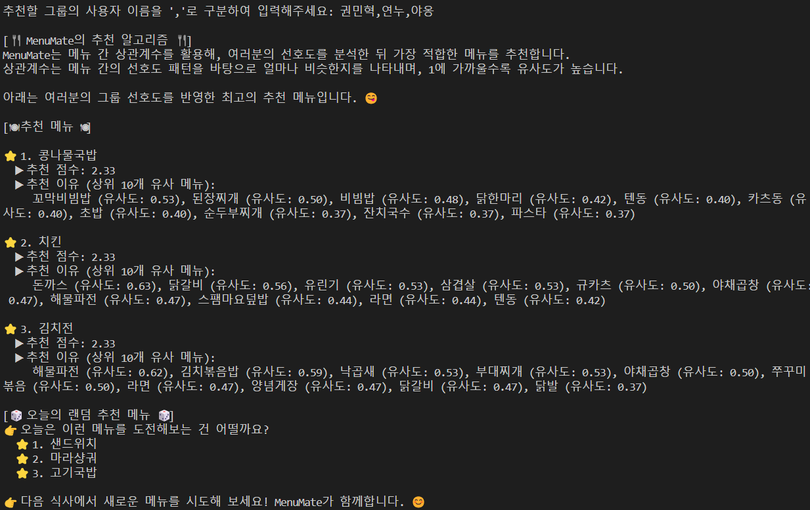
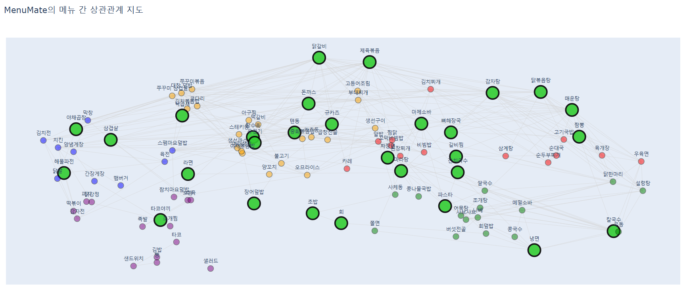

# MenuMate 🍽️  

> 혼자서도, 여럿이서도 고민 없이 메뉴 선택하기

MenuMate는 여러분의 식사 선호도를 스마트하게 분석하여 최적의 메뉴를 추천해주는 똑똑한 프로그램입니다.
맛있는 메뉴 선택을 도와줄 MenuMate를 사용해보세요!


## ✨ 이런 분들에게 추천해요
- 매일 점심 메뉴 고민하시는 분
- 회식/모임 장소 정하기 어려우신 분
- 새로운 음식을 찾고 싶으신 분
- 자신의 음식 취향을 알고 싶으신 분


## 주요 기능 🛠️
### 1. 나만의 맛 프로필 분석  
   - 내가 좋아하는 음식 스타일 파악
   - 선호하는 맛과 메뉴를 시각화
   - 상세한 개인 맛 레포트 제공

     
   - 사용자가 좋아하는 맛과 메뉴 종류를 바 차트로 시각화합니다.

    
   - 사용자가 좋아하는 맛을 레이더 차트로 시각화합니다. 

   
   - 사용자의 선호 메뉴를 분석하여 텍스트 레포트로 제공합니다.

### 2. 그룹 맞춤 메뉴 추천
   - 여러 사람의 취향을 고려한 최적의 메뉴 추천
   - 오늘의 랜덤 추천 메뉴 제공

   
   - 그룹 메뉴 추천 결과를 텍스트 레포트로 제공합니다.

### 3. 메뉴 탐색 지도
   - 사용자가 선호하는 메뉴와 유사한 메뉴를 시각적으로 표현한 인터랙티브 메뉴 지도를 생성합니다.

   
   - MenuMate에서 제공하는 메뉴 지도에서 사용자가 선호하는 메뉴를 강조하여 표현합니다.
   - 이를 기반으로 좋아하는 메뉴와 유사한 메뉴를 탐색해볼 수 있습니다.


## 설치 및 실행 방법 🖥️

### 시작하기 전에 필요한 것들
- Python 3.7 이상이 설치되어 있어야 해요
- pip (파이썬 패키지 관리자)가 필요해요
  

### 따라하기
1️⃣ **프로그램 다운로드**
```bash
# GitHub에서 프로그램을 다운로드해요
git clone https://github.com/ellocani/MenuMate.git

# MenuMate 폴더로 이동해요
cd MenuMate
```

2️⃣ **필요한 프로그램 설치**
```bash
# 필요한 라이브러리를 한 번에 설치해요
pip install -r requirements.txt
```

3️⃣ **실행하기**
```bash
# MenuMate를 실행해요
python app/app.py
```


## 📖 사용 방법

### 메인 메뉴 살펴보기

1️⃣ **개인 레포트 분석** 📊
- 이름만 입력하면 나만의 맛 분석 리포트가 나와요
- 내가 좋아하는 음식 스타일을 한눈에 확인할 수 있어요

2️⃣ **그룹 메뉴 추천** 👥
- 함께 식사할 멤버들의 이름만 입력하세요
- 모두가 만족할 수 있는 메뉴를 추천해드려요
- 친구들과 함께 등록하여 사용해야 하지만, 처음에 테스트 해볼 수 있는 유저 이름은 다음과 같아요
- 권민혁,야옹,연누,안태우,류지학,한규상,이상호,김건우,유수연,유서진

3️⃣ **메뉴 지도 보기** 🗺️
- 내가 좋아하는 메뉴와 비슷한 새로운 메뉴를 발견해보세요
- 메뉴들 사이의 관계를 시각적으로 확인할 수 있어요

4️⃣ **사용자 정보 확인** 🔍
- 내 정보가 있는지 확인할 수 있어요
- 설문 응답 내용도 다시 볼 수 있어요

5️⃣ **새로운 사용자 등록하기** ✨
- 처음이신가요? 간단한 설문으로 시작해보세요
- 100가지 메뉴에 대한 선호도를 1~4점으로 평가해주세요

6️⃣ **추천 시스템 이해하기** 💡
- MenuMate가 어떻게 메뉴를 추천하는지 알아보세요


## 📜 라이선스
MenuMate는 MIT 라이선스를 따릅니다.


## 📧 문의하기
궁금한 점이 있으신가요? 언제든 문의해주세요!
- GitHub Issues에 질문을 남겨주세요
- 이메일: min130111@naver.com
