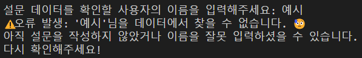
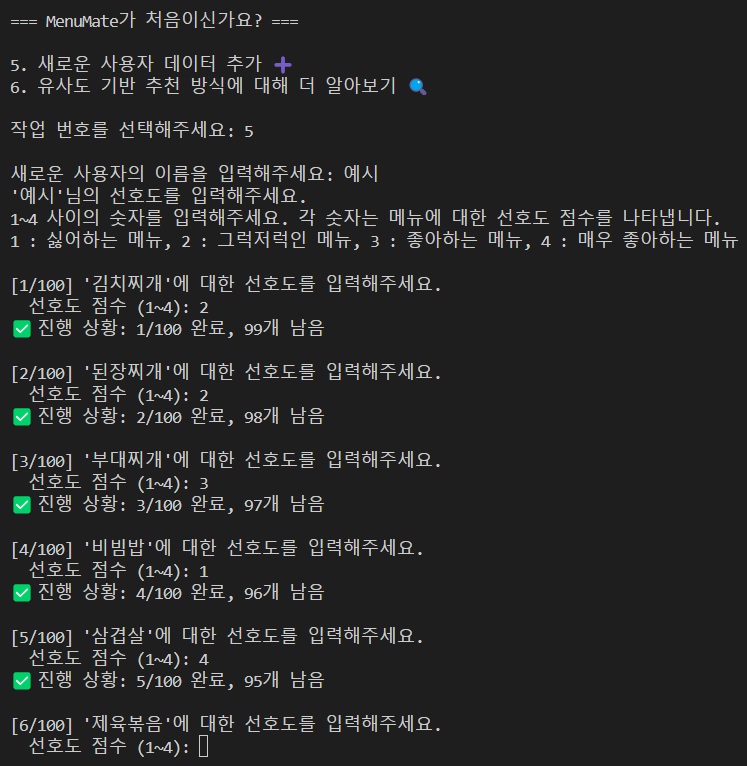
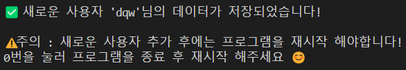

# MenuMate 🍽️  
MenuMate는 사용자의 식사 선호도를 분석하고, 데이터를 기반으로 개인 또는 그룹에 맞춘 추천 메뉴를 제공하는 프로그램입니다.  
맛있는 메뉴 선택을 도와줄 MenuMate를 사용해보세요!

---

## 주요 기능 🛠️
1. **개인 레포트 분석**  
   - 사용자의 선호 메뉴, 기피 메뉴, 맛 프로파일, 메뉴 분류 등을 분석하여 상세 레포트를 제공합니다.
   - 결과는 텍스트와 시각화 형태로 확인 가능합니다.
     
   - 사용자가 좋아하는 맛과 메뉴 종류를 바 차트로 시각화합니다.
    
   - 사용자가 좋아하는 맛을 레이더 차트로 시각화합니다. 
   
   - 사용자의 선호 메뉴를 분석하여 텍스트 레포트로 제공합니다.

2. **그룹 메뉴 추천**  
   - 여러 사용자 데이터를 분석하여 그룹의 취향에 맞는 추천 메뉴를 제공합니다.
   - 오늘의 랜덤 추천 메뉴도 함께 제안합니다.
   
   - 그룹 메뉴 추천 결과를 텍스트로 제공합니다.

3. **사용자 선호도 기반 메뉴 지도 생성**  
   - 사용자가 선호하는 메뉴와 유사한 메뉴를 시각적으로 표현한 인터랙티브 메뉴 지도를 생성합니다.
   
   - MenuMate에서 제공하는 메뉴 지도에서 사용자가 선호하는 메뉴를 강조하여 표현합니다.
   - 이를 기반으로 좋아하는 메뉴와 유사한 메뉴를 탐색해볼 수 있습니다.

4. **사용자 존재 및 설문 데이터 확인**  
   - 특정 사용자가 데이터에 존재하는지 확인하고, 해당 사용자의 설문 데이터를 출력합니다.
   
   - 사용자 이름을 입력하면 해당 사용자의 설문 데이터를 출력합니다.
   - 사용자가 존재하지 않으면 존재하지 않는 사용자라고 알립니다.

5. **새로운 사용자 데이터 추가**  
   - 새로운 사용자 데이터를 추가하여 MenuMate의 분석 대상에 포함할 수 있습니다.
   
   - 처음 한 번, 100개의 메뉴에 대해 1~4점으로 선호도 설문을 진행해야 합니다.
   - q를 입력하면 설문을 종료할 수 있습니다.
   
   - 주의: 새로운 사용자를 추가한 후엔, 반드시 프로그램을 재시작해야 합니다.

6. **추천 알고리즘 소개**  
   - MenuMate의 추천 로직과 유사도 계산 방식을 설명합니다.

---

## 설치 및 실행 방법 🖥️

### 1. **필수 요구사항**
- Python 3.7 이상
- 필수 라이브러리 설치:
  ```bash
  pip install -r requirements.txt
   ```
  
### 2. **프로젝트 설치**
```bash
# 이 저장소를 클론합니다
git clone https://github.com/ellocani/MenuMate.git
cd MenuMate

# 데이터 파일이 data 디렉토리에 준비되어 있는지 확인합니다:
# processed_menu_details.csv
# processed_user_data.csv
# menu_details.csv

# 프로그램 실행
python app.py
```

## 사용 방법 📖
### 실행 후 주요 메뉴
1. 개인 레포트 분석 📝
   - 사용자 이름을 입력하면, 개인의 선호도를 분석한 레포트를 제공합니다.

2. 그룹 메뉴 추천 🍽️
   - 여러 사용자의 이름을 입력하면 그룹에 맞춘 추천 메뉴를 확인할 수 있습니다.

3. 사용자 선호도 기반 메뉴 지도 생성 🗺️
   - 사용자 데이터를 기반으로 메뉴 간의 상관관계를 시각적으로 표현합니다.

4. 사용자 존재 및 설문 데이터 확인 📋
   - 특정 사용자가 데이터에 있는지 확인하고, 설문 데이터를 출력합니다.

5. 새로운 사용자 데이터 추가 ➕
   - 새로운 사용자의 이름을 입력해 데이터에 추가합니다.
   - 처음 한 번, 100개의 메뉴에 대해 1~4점으로 선호도 설문을 진행해야 합니다.

6. 추천 알고리즘 설명 🔍
   - MenuMate의 추천 로직을 상세히 이해할 수 있습니다.

### 파일 구조 📂
```plaintext
MenuMate/
│
├── data/                        # 데이터 파일
│   ├── processed_menu_details.csv
│   ├── processed_user_data.csv
│   └── menu_details.csv
│
├── src/                         # 주요 기능 코드
│   ├── data_loader.py           # 데이터 로딩
│   ├── user_analysis.py         # 개인 분석
│   ├── group_analysis.py        # 그룹 추천
│   ├── visualizations.py        # 시각화
│   ├── menu_interactive_map.py  # 메뉴 지도 생성
│   ├── add_user.py              # 사용자 추가
│   └── user_details.py          # 사용자 확인 및 설문 매핑
│
├── app.py                       # 실행 파일
├── requirements.txt             # 필수 라이브러리
└── README.md                    # 설명 파일
```

### 라이선스 📜
이 프로젝트는 MIT 라이선스를 따릅니다.

### 문의 📬
궁금한 점이나 문제가 있다면, 이슈를 등록해 주세요.
